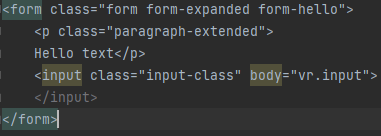

# tagger

****

## 1. What it is for?

Imagine that you have some go objects that you want to render, for example into your page. By usage of this package you
are able to render these objects into functional html! Its still simple, but feel free to **contribute** and watch 😅

**This is example html created by this creator:**

